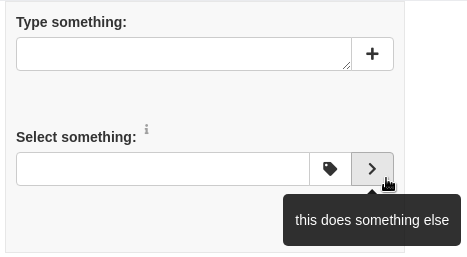

# shinypanel

### Installation

```R
remotes::install_github('alexvpickering/shinypanel')
```

### Usage

Example control panel with button-attached inputs and tooltips:

```R
library(shiny)
library(shinyBS)

ui <- fluidPage(
  div(class = 'row',
      div(class = 'col-sm-12 col-lg-6',
          div(class = 'well-form well-bg',
              textAreaInputWithButtons(
                id = 'text', 
                label = 'Type something:', 
                actionButton('btn3', '', icon('plus', 'fa-fw'), title = 'Click to add something')
              ),
              selectizeInputWithButtons(
                id = 'selection',
                label = 'Select something:',
                label_title = 'Information about input',
                actionButton('btn1', '', icon('tag', 'fa-fw'), title = 'this does something'),
                actionButton('btn2', '', icon('chevron-right', 'fa-fw'), title = 'this does something else'),
                options = list(multiple = TRUE)
              )
          )
      ),
      div(class = 'col-sm-12 col-lg-6',
          plotOutput('plot')
      )
  )
)


server <- function(input, output, session) {
  
  choices <- reactive({
    paste('Long Option', 1:5)
  })
  
  observe({
    updateSelectizeInput(session, 'selection', choices = choices())
  })
}

shinyApp(ui, server)
```


